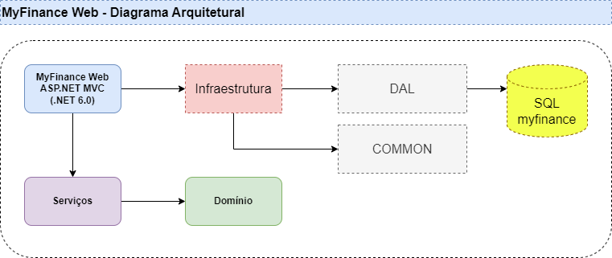

## My Finance Web

Pos-graduação Especialização em Engenharia de Software - Práticas de Implementação e Evolução de Software - Trabalho Prático Final.

Wager Cipriano - 993540

Implementação de uma aplicação Web, aquitetura MVC, em dotnet C# para controle de finanças:
[Link da Atividade no LMS](https://pucminas.instructure.com/courses/152488/discussion_topics/584975)

## Requisitos:

Runtimes:

- Microsoft.AspNetCore.App 7.0.13 [/usr/lib/dotnet/shared/Microsoft.AspNetCore.App]
- Microsoft.NETCore.App 7.0.13 [/usr/lib/dotnet/shared/Microsoft.NETCore.App]

SDKs:

- 7.0.113 [/usr/lib/dotnet/sdk]

## Banco de dados:

O banco de dados foi implementado no MS SQL Server, versão 2019-latest

## Arquitetura:

### Diagrama Arquitetural

Arquitetura utilizada foi o MVC, um padrão de design usado para desacoplar a interface do usuário (VIEW), os dados (MODEL) e a lógica do aplicativo (CONTROLLER).



### Frontend

- Razor ([ref](https://learn.microsoft.com/pt-br/aspnet/core/mvc/views/razor?view=aspnetcore-7.0))

### Backend

- Dotnet .NET
- SGBD: MS SQL Server 2019-latest
- C# + EntityFrameworkCore + EntityFrameworkCore.SqlServer
- AutoMapper + AutoMapper.Extensions.Microsoft.DependencyInjection
- DotEnv.Core

## Create local Database

1. Create MS Sql Server instance (container docker)
   `docker pull mcr.microsoft.com/mssql/server:2019-latest`
   `docker run -e "ACCEPT_EULA=Y" -e "MSSQL_SA_PASSWORD=SqlS1-Fin" -e "MSSQL_PID=Express" --name sql1 --hostname sql1 -p 1433:1433 -d mcr.microsoft.com/mssql/server:2019-latest`
1. Configure database access (host, port, user, passwd)
1. Conn instance
1. Create database: name myfinance
1. Execute Script.sql
1. Connection String
   DATABASE_URL. Example: `@"Server=localhost,1433\\Catalog=myfinance;Database=myfinance;User=sa;Password=SqlS1-Fin;TrustServerCertificate=True;"`

## Setup Local

Procedimento para instalação local:

1. Clone project:
   `git clone git@github.com:wcipriano/myfinance-web-dotnet.git`
1. Open project folder:
   `cd myfinance-web-dotnet`
1. Create _.env_ file on the project root dir, and insert keys: `CONNECTION_STRING`
1. Open src folder:
   `cd myfinance-web-dotnet`
1. Install Nuget packages:

   ```
   dotnet add package Microsoft.EntityFrameworkCore --version 7.0.13
   dotnet add package Microsoft.EntityFrameworkCore.SqlServer --version 7.0.13
   dotnet add package AutoMapper --version 12.0.1
   dotnet add package AutoMapper.Extensions.Microsoft.DependencyInjection  --version 12.0.1
   dotnet add package DotEnv.Core --version 3.0.0
   ```

   Lib nuget online: [url example](https://www.nuget.org/packages/Microsoft.EntityFrameworkCore.SqlServer/7.0.13)

1. Build application: `dotnet build`
1. Run the application: `dotnet watch run`

## Funcionalidades extras implementadas:

- [x] RF100 – Confirmação ao excluir Transação
- [x] RF101 – Ajuste Tela de Plano de Contas: Tipo = radio.
- [x] RF102 – Ajuste Tela de Registro de Transações: Incluir Forma Pgto
      pagamento com validação de campo apenas para transações do tipo "Despesa"
- [ ] RF103 – Relatório de Transações por Período:
- [ ] RF104 – Gráfico de Receitas vs Despesas por Período:

## Backlog:

- [ ] Plano contas: Form Validation
- [ ] Transações: Colocar data padrão sendo a data atual no form (/src/Views/Transacao/Cadastro.cshtml)
- [ ] Melhorias Layout, topo, rodape, etc
- [ ] Testes unitários

## REFS:

- [Learn Entity Framework Core](https://www.learnentityframeworkcore.com/dbcontext/)
- [SOLID](https://medium.com/desenvolvendo-com-paixao/o-que-%C3%A9-solid-o-guia-completo-para-voc%C3%AA-entender-os-5-princ%C3%ADpios-da-poo-2b937b3fc530)
- [Clean Code - Guia e Exemplos](https://balta.io/artigos/clean-code)
- [Refatoração e suas principais técnicas](https://blog.geekhunter.com.br/refatoracao/)
- [Aula 1 - Apresentação projeto My Finance Db](https://pucminas.instructure.com/courses/152488/pages/aula-1?module_item_id=3366815)
